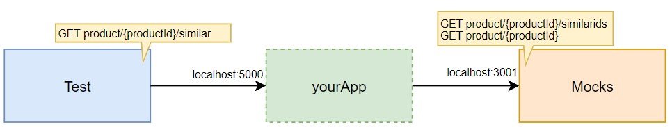

# Backend stress test optimization

"We want to offer a new feature to our customers showing similar products to the one they are currently seeing. To do
this we agreed with our front-end applications to create a new REST API operation that will provide them the product
detail of the similar products for a given one. [Here](./similarProducts.yaml) is the contract we agreed.

We already have an endpoint that provides the product Ids similar for a given one. We also have another endpoint that
returns the product detail by product Id. [Here](./existingApis.yaml) is the documentation of the existing APIs."



## Testing

Start the mocks and other needed infrastructure with the following command.

```
docker-compose up -d simulado influxdb grafana
```

To execute the test run:

```
docker-compose run --rm k6 run scripts/test.js
```
